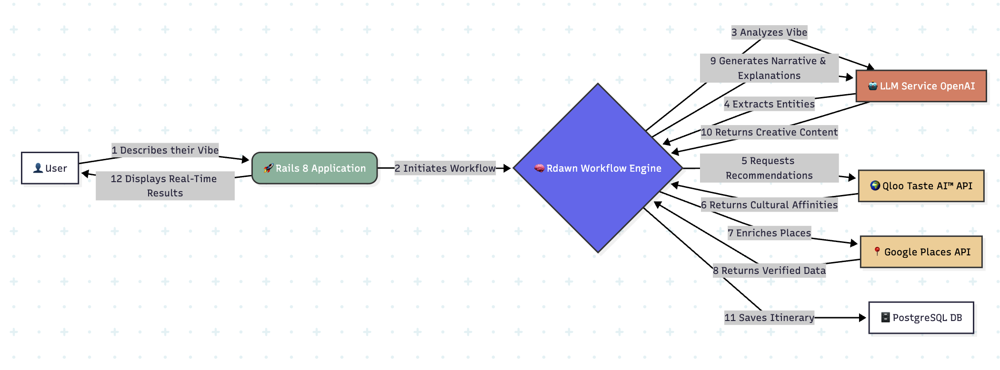

# VibeVoyage 🚀

**VibeVoyage is not a travel planner. It's a story-generation engine.**

This prototype was developed for the **Qloo Global Hackathon**, with the goal of demonstrating a deep synergy between generative artificial intelligence (LLMs) and Qloo's cultural affinity API. VibeVoyage transforms a user's abstract descriptions of a "vibe" or mood into narrative, personalized, and culturally rich itineraries.

### Hackathon Requirements Compliance

> This project integrates a Large Language Model (LLM) with **Qloo’s Taste AI™ API** to create an original software application. It demonstrates how Qloo's Taste AI™ connects behavior with cultural context, allowing systems to make sense of people’s preferences across different domains and creating a personalized travel experience.

### Key Links
*   **Demo Video (YouTube):** `[LINK TO YOUR 3-MINUTE VIDEO HERE]`
*   **Functional Demo:** `[LINK TO YOUR DEPLOYED APPLICATION HERE]`

---

## 🏛️ Architecture & Scalability

VibeVoyage was designed from the ground up for scalability, ensuring it can grow from a prototype to a high-traffic, production-grade application. The architecture is built on key principles of containerization, asynchronous processing, and a multi-tiered data layer.



### Progressive Scaling Strategy

The platform is engineered to scale gracefully over time. Below is a multi-stage strategy for handling growth, leveraging components already present in the codebase.

#### Stage 1: Initial Deployment (Current State)
The current setup is optimized for a robust and manageable single-server deployment using Kamal.
*   **Containerization:** The `Dockerfile` creates a production-ready container, ensuring environment consistency.
*   **Database-Backed Jobs:** `Solid Queue` is used as the Active Job backend. It leverages the primary PostgreSQL database, offering resilience and simplicity for initial launch.
*   **Database-Backed Caching:** `Solid Cache` serves as the Rails cache store, providing persistence for job statuses and API results across deployments.
*   **Real-Time Updates:** `Action Cable` is configured to use **Redis** in production (`config/cable.yml`), ensuring real-time UI updates are already scalable and efficient.

#### Stage 2: Decoupling Services (Medium Scale)
As traffic increases, the first step is to separate the web and job processing workloads.
*   **Dedicated Job Workers:** Using Kamal's roles (as defined in `config/deploy.yml`), we can deploy dedicated `job` servers that exclusively run the `Solid Queue` workers. This prevents intensive AI processing jobs (`ProcessVibeJobIntelligent`) from impacting the responsiveness of the web servers.
*   **Managed Database:** The PostgreSQL database can be migrated from the application server to a dedicated, managed service (e.g., AWS RDS, Google Cloud SQL). This isolates database load and provides better performance, backups, and reliability.

#### Stage 3: High-Performance Data Layer (Large Scale)
To handle significant load and reduce latency, we can switch the database-backed components to a dedicated in-memory data store. The `Gemfile` already includes `redis` and `sidekiq`.
*   **Switch to Sidekiq:** The Active Job adapter in `config/environments/production.rb` can be switched from `:solid_queue` to `:sidekiq`. This leverages Redis for a high-throughput job processing system, capable of handling thousands of jobs per second.
*   **Switch to Redis Cache:** The Rails cache store can be updated from `:solid_cache_store` to `:redis_cache_store`. This provides sub-millisecond latency for cache operations, significantly speeding up job status polling and API caching.

#### Stage 4: Full Horizontal Scaling (Massive Scale)
The architecture is now ready for massive horizontal scaling.
*   **Load Balancing:** Multiple web worker servers can be placed behind a load balancer. Kamal's architecture fully supports this model, allowing us to add more web servers as needed.
*   **Database Read Replicas:** For read-heavy operations (like browsing shared itineraries), PostgreSQL read replicas can be added to distribute the database load.
*   **CDN for Assets:** A Content Delivery Network (e.g., Cloudflare, AWS CloudFront) can be used to serve compiled assets, reducing load on the web servers and improving global performance.

---

## 💼 Business Case

VibeVoyage is positioned to capture a high-value segment of the travel market and extend into a scalable B2B model.

#### Market
*   **TAM (Total Addressable Market):** The primary target market is **cultural travelers** (Millennials and Gen Z) seeking authentic, personalized experiences—a segment that values narrative over logistics. We estimate this market at over $300 billion annually.
*   **B2B Model:** The true scaling potential lies in a B2B model, offering our API to hotels, airlines, travel agencies, and booking platforms so they can provide hyper-personalized itineraries as a value-added service.

#### Monetization
VibeVoyage will operate under a diversified revenue model:
*   **Freemium (B2C):** Users can create a limited number of itineraries per month, experiencing the core value of the product.
*   **Pro (B2C):** A monthly subscription ($19.99/month) unlocks unlimited itineraries, advanced "Cultural DNA" analysis, and premium recommendations.
*   **API (B2B):** A pay-as-you-go model for other businesses to integrate our story-generation engine into their own platforms.

#### Competitive Advantage
Our advantage lies not in a single component, but in the **orchestrated synergy** of three key technologies, creating a difficult-to-replicate barrier to entry:

1.  **`rdawn` (Native Orchestration):** Our custom workflow gem allows for deep, native integration with the Rails ecosystem. Unlike external solutions, `rdawn` gives us full control over the logic of task chaining, retries, and error handling, optimizing communication between the LLM and APIs.
2.  **Qloo (Cultural Data):** Qloo is not just a database; it's an affinity graph. It provides the cultural "why" behind a recommendation, allowing the LLM to generate narratives that resonate on a deeper level than a simple list of popular places.
3.  **LLMs (Creativity and Narrative):** The LLM acts as the "creative director," taking structured data from Qloo and practical data from other APIs to weave a compelling, personalized story.

---

## 🛠️ Project Structure

*   `docs/`: Documentation, UI design, and PRD.
*   `vibevoyage/`: Rails 8 + Tailwind + PostgreSQL application.

## 📋 Environment Requirements

*   Ruby 3.3+
*   Rails 8.0+
*   PostgreSQL

## 🚀 Getting Started

1.  **Install dependencies:**
    ```bash
    cd vibevoyage
    bundle install
    ```
2.  **Set up the database:**
    ```bash
    rails db:create
    rails db:migrate
    ```
3.  **Start the server:**
    ```bash
    rails server
    ```
4.  **Access the application** at `http://localhost:3000`.

---

## 🌟 The Vision

**VibeVoyage is not a travel planner. It's a story-generation engine, with a B2C business model and a B2B API to empower the entire hospitality industry. This is the future of personalized experiences.**
